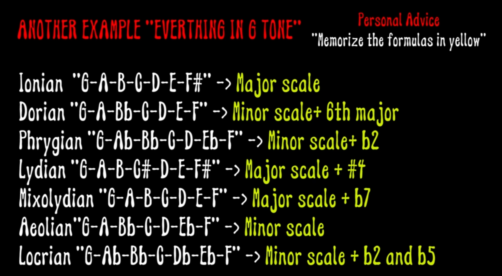

# Guitar Theory

## Links

[Pentatonic scale licks](pentatonic_scale/README.md)  
[Triads](triads/README.md)  


---
</br>


## Guitar notes


---
</br>


## Scales

### Minor/Major


### Pentatonic Minor Scale

Pentatonic minor scale is minor scale where the 2nd and 6th notes are removed.  

```
For example:  
 Minor A :           A B C D E F G
 Minor A Pentatonic: A C D E G

```

### Pentatonic Minor Blues Scale

Pentatonic minor blues scale is same as minor pentatonics,  
 with one added note, the b5.  


```
For example:  
 Minor A :                 A B C D E F G
 Minor A Pentatonic:       A C D E G
 Minor A blues Pentatonic: A C D Eb E G

```

---
</br>


## Power Chords

Power chord are contructed from the root and the 5th.  
For example, look in G major power chord:  

G A B C D E F# G  

G - root  
D - 5th  


---
</br>

## Music Intervals


---
</br>

## Modes 



