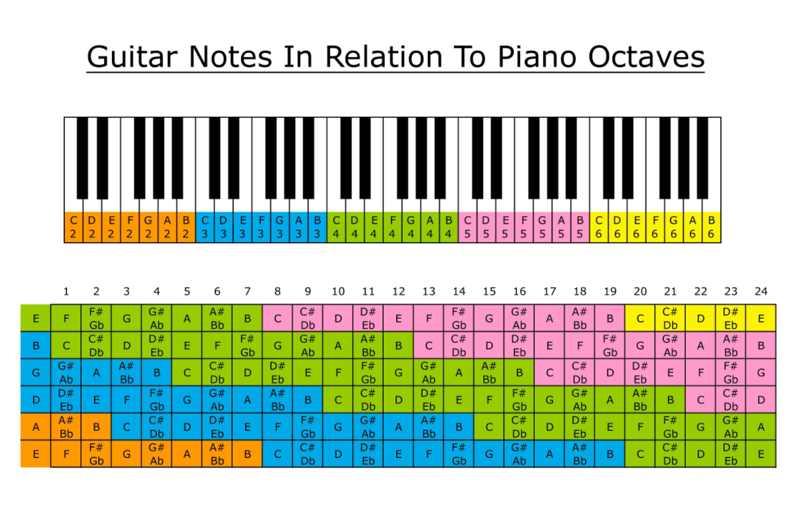
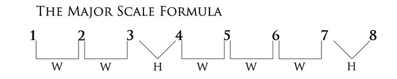
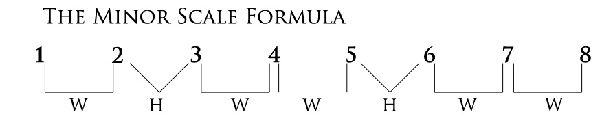
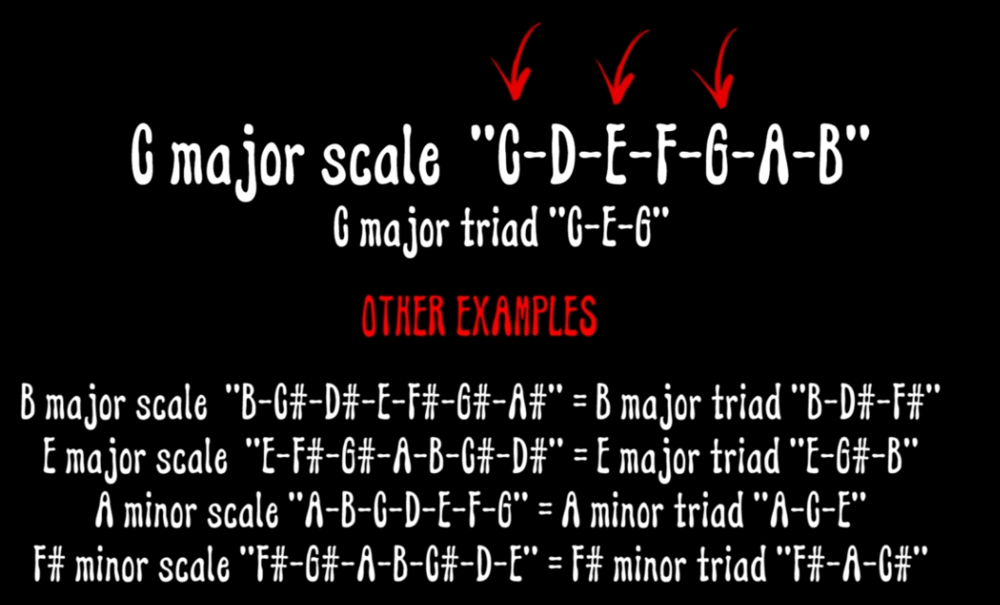
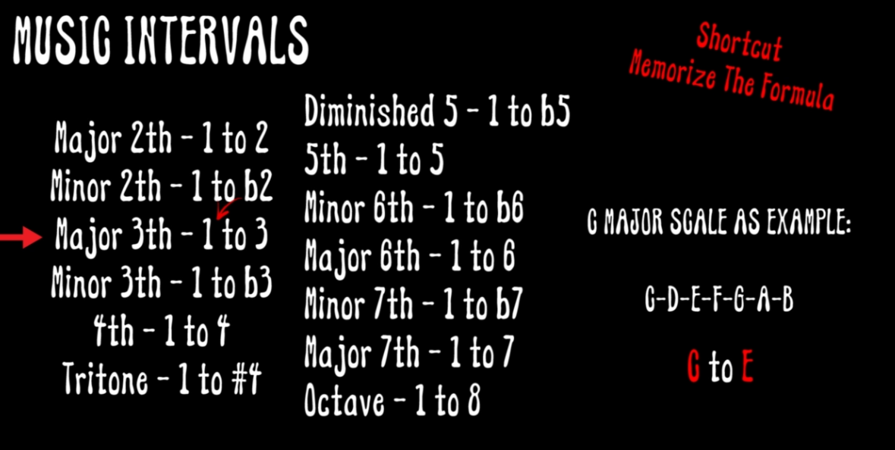

# Guitar Theory

## Guitar notes




---
</br>


## Scales

### Minor/Major





### Pentatonic Minor Scale

Pentatonic minor scale is minor scale where the 2nd and 6th notes are removed.  

```
For example:  
 Minor A :           A B C D E F G
 Minor A Pentatonic: A C D E G

```

### Pentatonic Minor Blues Scale

Pentatonic minor blues scale is same as minor pentatonics,  
 with one added note, the b5.  


```
For example:  
 Minor A :                 A B C D E F G
 Minor A Pentatonic:       A C D E G
 Minor A blues Pentatonic: A C D Eb E G

```

---
</br>


## Triads

### Major Triads

Major triad consists of 1,3,5 of the major scale.  

```
For example - Major G Triad

Major Scale: W W H W W W H

Major G Scale: G A B C D E F# G  
               1 2 3 4 5 6 7  8

Major G Triad: G(1) B(3) D(5)

```

### Minor Triads

Minor triad consists of 1,3,5 of the minor scale.  

```
For example - Minor G Triad

Minor Scale: W H W W H W W

Minor G Scale: G A A# C D D# F G  
               1 2 3  4 5 6  7 8

Minor G Triad: G(1) A#(3) D(5)

```

### Examples




---
</br>


## Power Chords

Power chord are contructed from the root and the 5th.  
For example, look in G major power chord:  

G A B C D E F# G  

G - root  
D - 5th  


---
</br>

## Music Intervals


