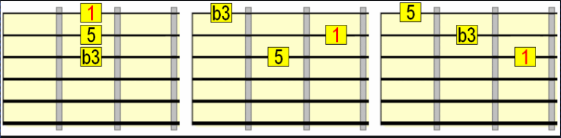
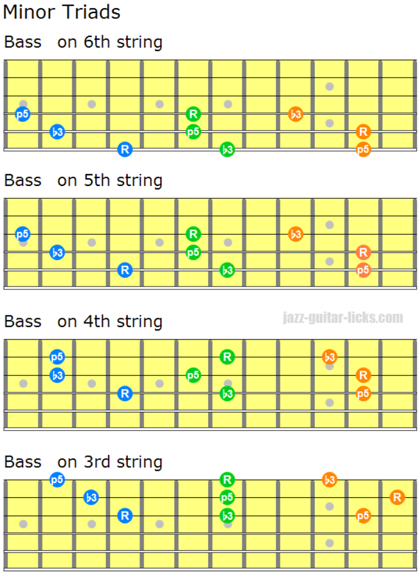
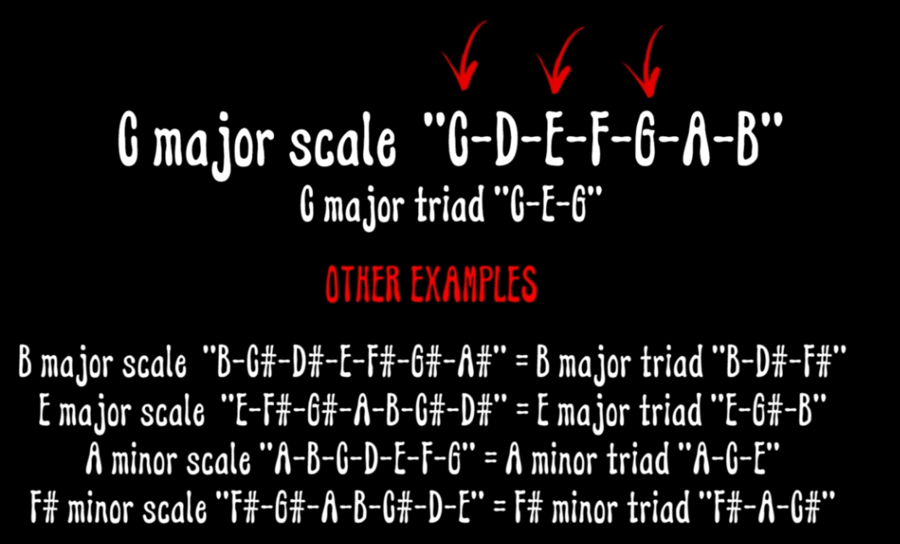
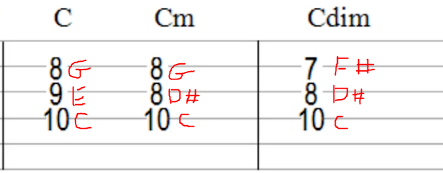
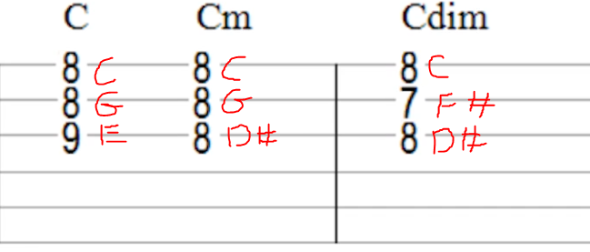

# Triads

## Major Triads

Major triad consists of 1,3,5 of the major scale.  

```
For example - Major G Triad

Major Scale: W W H W W W H

Major G Scale: G A B C D E F# G  
               1 2 3 4 5 6 7  8

Major G Triad: G(1) B(3) D(5)

```

## Minor Triads

Minor triad consists of 1,3,5 of the minor scale.  

```
For example - Minor G Triad

Minor Scale: W H W W H W W

Minor G Scale: G A A# C D D# F G  
               1 2 3  4 5 6  7 8

Minor G Triad: G(1) A#(3) D(5)

```


## Shapes

Triad shapes on strings G-B-E



### A Minor (A C E)
```
E|--5A------C8------0E------  
B|--5E------A10-----1C------  
G|--5C------E9------2A------   
D|--------------------------  
A|--------------------------  
E|--------------------------  
```

### Triads on all strings




## Examples




### C triads



### C Inverted triads



